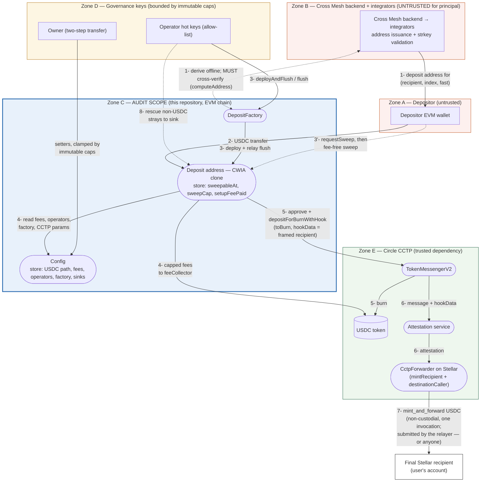

# Cross Mesh Ingress — Contracts: STRIDE Threat Model

> The latest version of this document is maintained online at
> [github.com/lightsail-network/crossmesh-ingress-contracts — docs/THREAT-MODEL.md](https://github.com/lightsail-network/crossmesh-ingress-contracts/blob/main/docs/THREAT-MODEL.md).

## Scope

- **In scope (the audit target):** the EVM contracts in this repository (`src/`) — `Config`,
  `DepositForwarder` (the CWIA implementation behind every deposit address), and
  `DepositFactory` — as built by the toolchain pinned in `foundry.toml` (Appendix A).
- **Parties:** _Cross Mesh_ is the service that operates the contracts — it holds the `Config`
  owner and operator keys, runs the Stellar relayer, and issues deposit addresses to
  _integrators_ over its API. Integrators are its B2B clients — wallet providers, other
  applications, or anyone else who obtains deposit addresses through the API: they show those
  addresses to _depositors_ (their end users) and may re-derive them offline. Neither party is
  trusted with principal.
- **Out of scope, modeled as adversarial or as a trusted dependency:** the Cross Mesh
  backend and operator/owner key custody (modeled as adversarial), and Circle's CCTP
  infrastructure on both sides — including the Stellar-side `CctpForwarder` that executes the
  final hop, which is **provided by Circle** as part of its CCTP deployment
  ([reference](https://developers.circle.com/cctp/references/stellar)). They appear throughout
  this model as _external entities and trust boundaries_; the property the model demonstrates is
  that the in-scope contracts bound the damage any of them can cause. No other first-party code
  exists on the fund path: this repository is the entirety of the team-owned on-chain surface.

---

## 1. What are we working on?

A depositor sends USDC on an EVM chain to a **counterfactual CREATE2 address** whose only
fund-moving behavior is to bridge its balance, via Circle CCTP V2, to one fixed Stellar recipient.
The recipient (a Stellar strkey, plus a 1-byte fast/standard flag) is a
**clones-with-immutable-args (CWIA) immutable argument**, so it is committed inside the address
itself: no key, admin, or upgrade path can redirect the principal — before _or_ after deployment.
The bound on the _owner_ (TB4) holds on a chain from a _verified_ `Config.init` onward: addresses
are computable everywhere, but an address is handed out for a chain only once Config is initialized
there and its wiring has been checked against Circle's published addresses (Elevation.3.R.1,
Appendix A).

Two settlement entrypoints, both flowing through internal `_settle`, **neither taking a
caller-chosen amount or destination**:

- `flush()` — operator/factory only; settles `min(balance, cctpBurnLimit)`; charges the service
  fees (one-time `setupFee` + `baseFee` + `settled × feePpm / 1e6`, each clamped by an immutable cap).
- `sweep()` — the permissionless escape hatch: anyone may `requestSweep()` (balance ≥ `MIN_SWEEP_AMOUNT`), and
  after `sweepDelay` (immutable bounds: `minSweepDelay` = 1 hour ≤ delay ≤ `maxSweepDelay` = 7 days,
  starting at the floor) anyone may `sweep()` **fee-free**,
  settling `min(balance, sweepCap, cctpBurnLimit)` to the same committed recipient. Sweeps always
  use CCTP _standard_ finality, so no fast-mode configuration can strand self-rescue.

A governance **access switch** (`Config.publicFlush`) opens `flush` — and the factory's one-tx
`deployAndFlush` — to everyone; the fee schedule still applies and is configured independently.
Combined with zeroed fees this is the planned wind-down mode, under which the contracts keep
working as a public good with no operator (see DoS.1.R.2).

### Components

| Element (DFD type)                                         | Role                                                                                                                                                                                                                                  |
| ---------------------------------------------------------- | ------------------------------------------------------------------------------------------------------------------------------------------------------------------------------------------------------------------------------------- |
| Depositor wallet (external entity)                         | Sends USDC; may also drive the escape hatch                                                                                                                                                                                           |
| Service backend (Cross Mesh) + integrator SDK (external entity) | Cross Mesh's backend derives deposit addresses and issues them to integrators over its API; integrators re-derive and verify them offline (open-source SDK); both validate strkeys; **untrusted for principal** |
| Operator hot keys (external entity)                        | Allow-listed settlement triggers (`flush`)                                                                                                                                                                                            |
| Owner (external entity)                                    | Governance over `Config`, bounded by immutable caps; two-step transfer                                                                                                                                                                |
| `DepositFactory` (process)                                 | Deterministic clone deployment (`deploy`, permissionless) + operator one-tx `deployAndFlush`                                                                                                                                          |
| Deposit address — CWIA clone (process + data store)        | Holds transient USDC; storage is only `sweepableAt`, `sweepCap`, `setupFeePaid`                                                                                                                                                       |
| `DepositForwarder` implementation (process)                | Settlement logic every clone delegates to                                                                                                                                                                                             |
| `Config` (process + data store)                            | One-time-init USDC path; owner-tunables clamped by immutable caps; operator list; factory pointer; fee/rescue destinations                                                                                                            |
| USDC token (external process)                              | ERC-20 being bridged                                                                                                                                                                                                                  |
| Circle `TokenMessengerV2` + attestation (external process) | Burns USDC, emits the cross-chain message                                                                                                                                                                                             |
| Circle `CctpForwarder` on Stellar (external process)       | `mintRecipient`/`destinationCaller` of every burn; mints and atomically forwards to the committed recipient (`mint_and_forward`). **Circle-provided**; the call is permissionless (no auth, recipient taken from the message) |
| Stellar relayer (external process, run by Cross Mesh)      | Fetches Circle's attestation and submits `mint_and_forward` for the settlements Cross Mesh flushes; a self-rescue sweep is completed manually today (automated relay pending). The call is permissionless: **anyone, including the depositor, can submit it** (DoS.1.R.3) |

### Data flow diagram

Zone colors encode the trust stance: **blue = the audited contracts**, red = adversarial actors,
amber = governance keys (bounded by immutable caps), green = the trusted Circle dependency. The
final recipient deliberately sits outside every zone: it is the user's own Stellar account —
past the system's trust surface, delivery there is the end state this model protects.

Numbered flows (threats in §2 reference these):

1. Cross Mesh's backend derives the deposit address for `(recipient, index, fast)` off-chain
   and **cross-verifies it against the on-chain `factory.computeAddress`**, then issues it to
   the integrator, which hands it to the depositor.
2. The depositor sends USDC to the address — which may not be deployed yet (counterfactual).
3. The operator settles via `factory.deployAndFlush` (deploy if needed, then `flush`).
   **3′ (escape hatch):** if the operator never does, anyone — typically the depositor — calls
   `requestSweep()` and, after the delay, `sweep()`.
4. Settlement reads `Config` (fees, CCTP params) and, on the `flush` path only, transfers the
   capped fees to `feeCollector`.
5. The clone approves `TokenMessengerV2` and calls `depositForBurnWithHook`, burning
   `settled − fees` with `hookData` framing the committed recipient.
6. Circle's attestation service observes the burn and attests the message.
7. Circle's attestation is fetched and `mint_and_forward(message, attestation)` is submitted to
   Circle's `CctpForwarder` on Stellar, which in a single non-custodial invocation mints and
   forwards USDC to the committed recipient. Cross Mesh's Stellar relayer does this for the
   settlements it flushed; the call is permissionless, so anyone — the depositor included — can
   submit it, which is how a self-rescue `sweep` completes (DoS.1.R.3). Circle's Forwarding
   Service does not serve Stellar, hence the zero `hookData` magic.
8. Side flow: stray native coin / non-USDC tokens are rescued, operator-gated, to the
   governance-set `rescueSink` (USDC is explicitly excluded from rescue — including on chains
   where the native coin _is_ USDC, see Elevation.5).

### Data entities

| Entity | Where it lives | Integrity anchor |
|---|---|---|
| USDC principal | Deposit address → CCTP burn → Stellar mint (flows 2–7) | No entrypoint takes an amount or destination; it can only move to the committed recipient |
| Recipient strkey + fast flag | CWIA immutable args; echoed in `hookData` (flows 1, 5) | Committed in the CREATE2 address; validated off-chain before issuance; verifiable via `recipient()` before funding |
| Service fees | `flush` → `feeCollector` (flow 4) | Each component clamped by an immutable cap; `total < settled` enforced; full split published in `Settled` |
| Config parameters | `Config` storage (flow 4) | USDC path is one-time `init`; tunables clamped by immutable caps; every change emits an event |
| Stray native coin / non-USDC tokens | Deposit address → `rescueSink` (flow 8) | Operator-gated; destination governance-set and non-zero; USDC excluded from rescue (`rescueERC20` by address, `rescueNative` by a USDC-balance-not-decreased post-condition; both refuse to run before `init`) |

### Trust boundaries

| #   | Boundary                                           | Trust stance                                                                                                                                        |
| --- | -------------------------------------------------- | --------------------------------------------------------------------------------------------------------------------------------------------------- |
| TB1 | Depositor ↔ integrator ↔ Cross Mesh (flow 1)  | **Untrusted.** A lying address distributor is a residual path to principal loss (Spoof.1), beside an invalid recipient (DoS.8), an unverified `init` (Elevation.3) and the accepted CCTP dependencies (DoS.5) |
| TB2 | Anyone ↔ deposit address (flows 2, 3′)             | Permissionless by design; safe because no caller input chooses amount or destination                                                                |
| TB3 | Operator/factory ↔ `flush` (flow 3)                | Semi-trusted: may _time_ settlements and charge _capped_ fees; cannot redirect                                                                      |
| TB4 | Owner ↔ `Config` setters                           | Semi-trusted: bounded by immutable caps; cannot touch the USDC path after `init`. The path itself is the owner's choice at `init` (sanity-checked, not authenticated), so addresses are issued for a chain only once it is initialized AND the wiring is verified against Circle's published addresses (Elevation.3.R.1) |
| TB5 | EVM contracts ↔ Circle CCTP (`TokenMessengerV2`, attestation, `CctpForwarder`) ↔ recipient (flows 5–7) | Trusted bridge dependency, pinned at `init`; the burn limit is probed before every settlement, and the hookData this repo emits matches Circle's published layout byte-for-byte (`_hookData`). Stellar-side submission (flow 7) is permissionless: Cross Mesh's relayer is a liveness convenience, not a trust dependency (DoS.1.R.3) |

---

## 2. What can go wrong?

STRIDE applied per flow. IDs below are referenced by the remediations in §3.

### Spoofing

| ID      | Threat (flow)                                                                                                                                              |
| ------- | ---------------------------------------------------------------------------------------------------------------------------------------------------------- |
| Spoof.1 | A compromised/hostile distributor hands the depositor an address committed to the **attacker's** recipient; deposits to it bridge to the attacker (flow 1) |
| Spoof.2 | A non-operator calls `flush` to force settlements (flow 3)                                                                                                 |
| Spoof.3 | An attacker "front-runs" or pre-deploys the clone for a victim's recipient to hijack it (flow 3)                                                           |
| Spoof.4 | The burn message is directed to a spoofed destination on Stellar (flows 5–7)                                                                               |

### Tampering

| ID       | Threat (flow)                                                                                         |
| -------- | ----------------------------------------------------------------------------------------------------- |
| Tamper.1 | Change a deposit address's recipient after it was issued (flows 1–7)                                  |
| Tamper.2 | Repoint the USDC path (`usdc` / `tokenMessenger` / `stellarForwarder`) to attacker contracts (flow 4) |
| Tamper.3 | Raise fees or the sweep delay beyond the worst case depositors verified (flow 4)                      |
| Tamper.4 | Corrupt the `hookData` so funds route to a different Stellar account (flow 5)                         |

### Repudiation

| ID          | Threat (flow)                                                                                      |
| ----------- | -------------------------------------------------------------------------------------------------- |
| Repudiate.1 | The operator over-charges and the fee accounting cannot be disputed/reconciled (flow 4)            |
| Repudiate.2 | A dispute over whether/where a deposit was settled cannot be resolved from public data (flows 5–7) |

### Information disclosure

| ID     | Threat (flow)                                                                                                         |
| ------ | --------------------------------------------------------------------------------------------------------------------- |
| Info.1 | The recipient-strkey ↔ deposit-address linkage is publicly enumerable (args, events), deanonymizing users (flows 1–2) |

### Denial of service

| ID    | Threat (flow)                                                                                                                                                              |
| ----- | -------------------------------------------------------------------------------------------------------------------------------------------------------------------------- |
| DoS.1 | The operator goes offline (or is shut down) and never settles (flow 3)                                                                                                     |
| DoS.2 | The operator griefs the self-rescue countdown by strategically partial-flushing (flows 3, 3′)                                                                              |
| DoS.3 | Dust below the fee floor can never be settled by `flush` (flow 4)                                                                                                          |
| DoS.4 | Fast-mode misconfiguration or a Circle fast-fee spike strands settlements (flow 5)                                                                                         |
| DoS.5 | Circle stops supporting the chain/token (burn limit 0, messenger retired) or denylists a deposit address as a CCTP caller (flow 5)                                        |
| DoS.6 | A balance above the CCTP per-message burn cap cannot be settled (flow 5)                                                                                                   |
| DoS.7 | `requestSweep` spam re-arms or extends windows to block operator settlement (flow 3′)                                                                                      |
| DoS.8 | A malformed or unroutable recipient strkey is committed at address creation; the burn succeeds but the Stellar-side forward cannot complete (flows 1, 7)                   |
| DoS.9 | While `publicFlush` is enabled with a non-zero fee schedule, anonymous callers can force per-deposit settlements, multiplying the base fees charged to depositors (flow 3) |
| DoS.10 | USDC is mis-sent to the `DepositForwarder` implementation address, which is not a clone and has no committed recipient (flows 1, 5)                                   |

### Elevation of privilege

| ID          | Threat (flow)                                                                                                       |
| ----------- | ------------------------------------------------------------------------------------------------------------------- |
| Elevation.1 | A compromised operator hot key abuses `flush` (flow 3)                                                              |
| Elevation.2 | The owner points `config.factory` at a hostile contract, which then holds flush rights (flow 3)                     |
| Elevation.3 | A compromised owner key abuses the `Config` setters (flow 4)                                                        |
| Elevation.4 | Fee evasion: pre-arm a sweep window with dust, then route real deposits through the fee-free `sweep` path (flow 3′) |
| Elevation.5 | On a chain where the native coin _is_ USDC (Arc), an operator uses `rescueNative` to move a deposit's principal to the rescue sink (flow 8) |
| Elevation.6 | Before `Config.init` on a chain, an operator passes the real USDC to `rescueERC20` — the `token != usdc` exclusion compares against the zero address (flow 8) |

---

## 3. What are we going to do about it?

Every treatment below is **implemented and tested** unless marked _risk accepted_.

### Spoofing

- **Spoof.1.R.1** — A deposit address is pure CREATE2 math over public inputs — the factory and
  implementation addresses plus the clone's immutable args (`recipient ++ fast`, salt
  `keccak256(recipient, index)`) — so anyone can recompute it fully **offline**, with no RPC and
  no trust in any service. The contracts additionally expose `computeAddress(recipient, index,
fast)` and `isDeployed` as the on-chain reference implementation. **Integrators
  MUST cross-verify every address they hand out** — the offline derivation and the on-chain
  factory must agree. The reference backend asserts identical derivation vectors on both paths
  (`test/CwiaVector.t.sol`).
- **Spoof.1.R.2** — A depositor can verify before funding: recompute the address, or call
  `recipient()` on the deployed clone to read the committed strkey.
- **Spoof.1.R.3** — _Risk accepted (residual):_ on-chain code cannot detect a poisoned address —
  it is a _valid_ deposit address, just not the user's. Correctly-derived addresses that were
  already issued are unaffected by any later distributor compromise.
- **Spoof.2.R.1** — `flush` requires `config.isOperator(msg.sender) || msg.sender ==
config.factory() || config.publicFlush()` — the third branch is the governance access switch
  that deliberately opens the gate to everyone during a wind-down (DoS.1.R.2, DoS.9). Whether
  spoofed or legitimately open, a call can only trigger a settlement to the committed recipient
  at the configured, capped fees (see Elevation.1).
- **Spoof.3.R.1** — Deployment is permissionless _and harmless_: identical `(recipient, index,
fast)` produce the identical address and behavior; there is no initializer, so nothing can be
  front-run, and `salt = keccak256(recipient, index)` cannot be hijacked for foreign args.
- **Spoof.4.R.1** — `mintRecipient` **and** `destinationCaller` of every burn are both Circle's
  `CctpForwarder` fixed in `Config` at one-time `init` (exactly as Circle's integration spec
  prescribes); no per-call destination input exists.

### Tampering

- **Tamper.1.R.1** — The recipient is a CWIA immutable argument committed in the CREATE2 address;
  clones have no setters, no initializer, and no upgrade path. Changing the recipient means a
  _different address_.
- **Tamper.2.R.1** — The USDC path is a one-time `init` latch (owner-only, zero-checked,
  `initialized` flag); immutable thereafter. `init` also applies partial sanity checks — both
  addresses must have code, the messenger must be CCTP V2 (`messageBodyVersion() == 1`; V1 has a
  minter and a limit too, but no hooked burn), its `localMinter()` must report a non-zero burn
  limit for the token, and it must have a remote TokenMessenger registered for Stellar — so the
  honest mistakes that could never settle cannot be latched permanently. They do not authenticate
  the pair as Circle's canonical one, nor judge a hostile owner's inputs (Elevation.3.R.1).
  Governing rule documented in `Config`: only values that provably cannot redirect USDC may be
  mutable.
- **Tamper.3.R.1** — Immutable caps clamp every tunable: `maxSetupFee`/`maxBaseFee` 100 USDC,
  `maxFeePpm` 1%, `minSweepDelay` 1 hour / `maxSweepDelay` 7 days, `maxCctpFeePpm` 1%. A depositor
  can verify the worst case on-chain before funding.
- **Tamper.4.R.1** — `hookData` is built on-chain (`_hookData`) from the committed immutable args
  with a fixed 32-byte frame matching Circle's published hookData layout byte-for-byte; no
  external input reaches it.

### Repudiation

- **Repudiate.1.R.1** — `Settled` publishes the full split — `settled`, `setupFee`,
  `perSettleFee`, `burned`, `viaSweep`, and the fast mode _requested_ from Circle (delivered
  finality and the executed CCTP fee appear only in the attested message) — for off-chain
  reconciliation; every `Config` setter emits an event. On the relayed path
  (`deployAndFlush`) `Settled.caller` is the factory, the clone's `msg.sender`; the factory's
  `FlushRelayed(caller, forwarder)` names the initiating account, paired with `Settled` by
  forwarder within the transaction.
- **Repudiate.2.R.1** — `Deployed`, `SweepRequested`, `Rescued*` events plus the CCTP message
  itself are public; the deterministic address derivation lets anyone re-prove the
  recipient-address binding after the fact.

### Information disclosure

- **Info.1.R.1** — _Risk accepted (by design):_ the commitment scheme is intentionally public —
  transparency is what lets depositors verify addresses (Spoof.1.R.2). No secrets exist in
  contract state; privacy-sensitive integrators must handle recipient linkage off-chain.

### Denial of service

- **DoS.1.R.1** — Permissionless, fee-free escape hatch: `requestSweep()` + `sweep()`, with the
  delay capped by the immutable `maxSweepDelay = 7 days`. Operator absence delays funds, never
  strands them. The hatch is owner-independent on the CCTP side too: the burn's `maxFee` is
  lifted to the messenger's own on-chain minimum fee (`_cctpMinFee`, a tolerant probe that reads 0
  where the messenger predates minimum fees), so a Circle minimum-fee change cannot halt `sweep`
  or standard `flush` pending an owner rate update; the burn fails only when Circle's required
  minimum exceeds the rounded, amount-clamped allowance under the immutable 1% cap (DoS.5.R.4).
  The hatch arms only over `MIN_SWEEP_AMOUNT` (2 subunits) and closes over less; the accepted
  residuals — a dust pre-arm costing a later depositor at most one extra `sweepDelay`, and a lone
  subunit that waits for the next deposit — are recorded in DoS.7.R.1 and Elevation.4.R.1.
- **DoS.1.R.2** — For a _deliberate_ wind-down, governance flips `Config.publicFlush` (opening
  `flush` and the factory's one-tx `deployAndFlush` to everyone) and zeroes the fee schedule —
  each knob single-purpose — so anyone settles any address in a single tx with no `requestSweep`
  wait. The switch cannot redirect USDC in either state — settlement always pays the committed
  recipient — and the sweep path (R.1) remains available regardless.
- **DoS.1.R.3** — Stellar-side delivery does not depend on the operator either. The burn is
  final on the EVM side; what remains is to fetch Circle's attestation and submit
  `mint_and_forward(message, attestation)` to Circle's `CctpForwarder`. Cross Mesh — the service
  that runs the operator key and issues addresses to integrators — runs a Stellar relayer
  that submits this for every settlement it flushes (best effort, no fixed SLA). A depositor's
  self-rescue `sweep` is detected by the same service and today completed manually on the
  Stellar side (automated relay of external sweeps is a backlog item), but it never has to wait
  for that: the call carries no authorization and the recipient is read from the message, so
  anyone — the depositor included — can submit it from any Stellar account holding XLM for the
  fee; the message and attestation are public. The remaining dependencies are Circle's: the
  attestation service and the forwarder not being paused by Circle (TB5). Circle's Forwarding
  Service does not serve Stellar, so the zero `hookData` magic (Circle's prescribed value)
  forgoes nothing.
- **DoS.2.R.1** — A partial `flush` cannot reset an armed window; the window closes only when the
  remaining armed `sweepCap` budget drops below `MIN_SWEEP_AMOUNT` or the balance is drained — and
  both outcomes deliver the armed funds to the committed recipient.
- **DoS.3.R.1** — `flush` reverts when fees would consume the settlement (`fee exceeds settled`),
  but `sweep` is fee-free and clamps CCTP `maxFee < toBurn`, so self-rescue works down to
  `MIN_SWEEP_AMOUNT` (2 subunits) — the smallest burn Circle accepts once a minimum fee is set
  (DoS.7.R.1).
- **DoS.4.R.1** — Fast is only ever _requested_ for _flush ∧ address-committed-fast ∧
  `fastEnabled`_; `sweep` always requests standard finality. Fast-fee configuration cannot strand
  USDC in a deposit address: the reviewed burn implementations — TokenMessengerV2 on Ethereum/Base
  (`0x555E272506c06E7E559D57418563742afE363EC8`) and Arc
  (`0x1CcaFdffBC1b7B5C499c97322F961B7d929a41b4`) — check only `maxFee < amount` and, where present,
  the finality-independent minimum fee, never the fast fee (Circle's fee page says a burn whose
  fee exceeds `maxFee` "will revert on the source blockchain"; the code governs here). Circle
  documents that an
  under-funded fast transfer _may_ be degraded to standard — a possible outcome, not a delivery
  guarantee: once burned, completion rests on Circle's attestation and destination execution
  (TB5), and `sweep` cannot recover a burned amount. `fastEnabled` therefore stops settlements
  from requesting (and reporting) a mode Circle would not honor; it governs future burns only and
  is not a guard against a revert. The standard path needs no owner-set allowance either
  (DoS.1.R.1). _Risk accepted:_ `setFastEnabled` and `setCctpFastMaxFeePpm` are deliberately not
  cross-checked: a non-zero allowance would not prove it covers Circle's current fast fee, so
  requiring `> 0` would reject only the exactly-zero configuration without establishing
  sufficiency. `Settled.fast` records the _requested_ mode and off-chain consumers must not read
  it as the delivered finality. The reference backend does not request fast at all today.
- **DoS.5.R.1** — `_burnLimit` probes `burnLimitsPerMessage` and reverts early
  (`burn unsupported`) instead of burning into a dead bridge.
- **DoS.5.R.2** — _Risk accepted (deliberate trade-off):_ if Circle permanently retired the
  pinned `TokenMessengerV2`, `flush` and `sweep` would both revert and USDC would sit in deposit
  addresses. The _absence_ of any admin USDC-recovery path is what keeps principal out of every
  key's reach after a verified `init`;
  operational mitigation is monitoring Circle deprecation notices per chain.
- **DoS.5.R.3** — _Risk accepted (same trade-off):_ `TokenMessengerV2` enforces a caller
  denylist, and every settlement calls it with the deposit address as `msg.sender`. If Circle
  denylists a deposit address, `flush` and `sweep` both revert and the USDC stays there until
  Circle removes the entry — there is no other exit, and adding an owner-controlled one would
  give up the "owner cannot redirect principal" property (Elevation.3.R.1). Operational
  mitigation is monitoring Circle's denylist for deposit addresses.
- **DoS.5.R.4** — _Risk accepted (deliberate trade-off):_ if Circle set a chain's minimum CCTP fee
  above the immutable `maxCctpFeePpm` cap (1%), the forwarder's allowance stops at the cap and a
  burn reverts at the messenger ("Insufficient max fee") whenever its required minimum exceeds
  that capped, rounded, `< amount`-clamped allowance — for a rate above the cap, essentially every
  `flush` and `sweep` on that chain, until the minimum comes back under the cap. Paying an
  uncapped minimum instead would let a Circle-side
  change (or a permissionless `sweep` caller) impose an unbounded fee on depositors; halting is
  the safer failure. Operational mitigation is monitoring Circle's fee announcements per chain.
- **DoS.6.R.1** — Settlement takes `min(balance, burnLimit)` per call (`sweep` also bounded by the
  armed `sweepCap`) and drains an above-cap balance over successive calls; the sweep window stays
  open across partial settlements with no fresh cooldown while the remaining armed budget is
  ≥ `MIN_SWEEP_AMOUNT`. A smaller remainder (an armed balance ≡ 1 mod `burnLimit`) closes the
  window instead of staying armed: it could never be burned under a Circle minimum fee and would
  otherwise pin the address against later deposits' own windows. The lone subunit cannot arm a
  sweep; it rides along with the next deposit's settlement, or with a zero-service-fee `flush`
  while Circle's minimum fee is zero (DoS.7.R.1).
- **DoS.7.R.1** — `requestSweep` requires `balance >= MIN_SWEEP_AMOUNT` (2 subunits: no pre-arming
  empty addresses, and no window over a balance CCTP could never burn — under a Circle minimum fee
  a 1-subunit burn cannot satisfy `maxFee >= 1` and `maxFee < amount` at once, so such a window
  would never sweep nor close), `flush` and `sweep` close a window whose remaining budget falls
  below that bound (DoS.6.R.1), and `requestSweep` is idempotent while armed (cannot extend an
  existing window). Arming never blocks `flush`: after the delay both paths are callable, and
  whichever executes first decides whether service fees are charged; the recipient is the same
  either way. _Residual, accepted:_ a third party can still pre-arm an address with a dust deposit
  (≥ 2 subunits), which delays a later depositor's _own_ window by at most one extra `sweepDelay`
  (≤ 7 days) and one transaction, and gives a fee-charging `flush` that much more opportunity to
  execute first; the committed recipient is unchanged.
- **DoS.8.R.1** — `deploy` commits the strkey bytes as-is by design (documented on `deploy`);
  full strkey validation in the address producers — Cross Mesh's backend and the open-source SDK
  integrators re-derive with — is the prescribed gate before any address is handed out, an
  operational dependency outside this repository. The rules both must enforce, mirroring the
  Stellar `CctpForwarder`: length 56 (`G`/`C`) or 69 (`M`), the RFC 4648 base32 alphabet with zero
  padding bits, a matching version byte, a valid CRC16-XMODEM checksum, and for a `C` key rejection
  of the `CctpForwarder` and USDC contract IDs themselves. _Risk accepted:_ on-chain validation in
  `DepositFactory._args` was considered and rejected. It would reject a malformed recipient in
  both `computeAddress` and `deploy`, so it would catch an off-chain validation bug during the
  reference flow's on-chain cross-check (flow 1), before issuance — though not for an address
  derived and funded entirely offline, which would then also be undeployable. It was not adopted
  because the acceptance rules belong to the Stellar forwarder and may evolve, which an immutable
  factory cannot follow (it would refuse valid keys, or admit new invalid ones, permanently), and
  because it would move every deposit address. The residual irreversible-burn risk of relying on
  off-chain validation is accepted.
- **DoS.8.R.2** — The commitment is verifiable _before funding_: recompute the address off-chain
  or read `recipient()` on the deployed clone — a validation failure is catchable while zero
  USDC has moved.
- **DoS.8.R.3** — _Risk accepted (residual):_ delivery for a well-formed but unroutable
  recipient follows the semantics of Circle's `CctpForwarder`, outside this repo's scope.
- **DoS.9.R.1** — The switch grants only operator-equivalent power: the operator could already
  settle per-deposit and charge the same fees, so no new trust tier appears; every fee stays
  clamped by the immutable caps, and settlement still pays the committed recipient.
- **DoS.9.R.2** — _Risk accepted (documented):_ `publicFlush` is designed to be flipped together
  with a zeroed fee schedule — the wind-down runbook of DoS.1.R.2 — and its setter documents the
  pairing; it is not intended to be enabled with fees still configured.
- **DoS.10.R.1** — `flush`, `requestSweep` and `sweep` are `onlyClone` (`address(this) != implementation`,
  the implementation's own address baked in as an immutable): on the implementation
  `fetchCloneArgs` would return its own runtime bytecode as the recipient — a burn that either
  reverts on the CCTP message-size cap (frozen) or, on a larger-cap chain, burns toward a
  recipient the Stellar forwarder rejects (lost). Refusing settlement there removes both.
- **DoS.10.R.2** — Recoverability: `rescueERC20` admits USDC only when `address(this) == implementation`.
  The implementation is never a deposit address and can never settle, so USDC there is by
  construction not principal — a mis-send, or collected fees if governance pointed `feeCollector`
  at it; it goes to the owner-set `rescueSink`, operator-gated
  like every rescue. On every clone the USDC exclusion is unchanged (Elevation.1.R.1).
- **DoS.10.R.3** — _Residual, accepted:_ the mis-sender has no on-chain claim; returning the funds
  is an off-chain operational matter once they reach the sink.

### Elevation of privilege

- **Elevation.1.R.1** — Operator worst case is _bounded, not prevented_: trigger settlements at
  capped fees and choose their timing. No amount, destination, or principal access: the rescue
  paths exclude USDC on every clone and every chain, native-USDC chains included (Elevation.5);
  the only USDC an operator can move sits on the implementation — a mis-send or collected fees,
  never principal (DoS.10.R.2). Keys are revocable per-address via `setOperator`.
- **Elevation.2.R.1** — The factory pointer only gates `flush`, so a hostile value is exactly
  operator-tier (Elevation.1): it may time settlements, including ahead of a fee-free sweep, and
  trigger fee collection to `feeCollector`; it cannot redirect USDC. A non-zero value must be a
  contract reporting `implementation().config() == this Config`, so the right cannot go to a
  mistyped or unrelated address by mistake; the check does not authenticate the code — a contract
  that lies about its wiring passes, with that operator-tier right only. A wrong value costs the
  legitimate operator only its one-tx relay. `setFactory(0)` revokes the factory-specific right
  only — an address that is also an operator, or anyone while `publicFlush` is on, keeps flushing.
- **Elevation.3.R.1** — Owner worst case is bounded by the immutable caps: fees at their caps,
  delay at 7 days, swapped fee/rescue destinations, fast disabled, flush opened to everyone
  (`publicFlush` — settlement access only, DoS.9). The owner **cannot** redirect principal (USDC path immutable,
  recipient committed, sweep permissionless) and **cannot** starve settlement by under-setting the
  CCTP fee allowance: the burn's `maxFee` is lifted to the messenger's on-chain minimum regardless
  of the owner rates (DoS.1.R.1). Two-step ownership transfer (`transferOwnership` +
  `acceptOwnership`) prevents accidental loss; `transferOwnership(0)` cancels a pending transfer.
  _Scope of the bound — accepted residual:_ it applies on a chain from a _verified_ `init`
  onward. `init` only sanity-checks its inputs, so a hostile pair latched at `init` stays hostile
  for every later deposit; what makes post-`init` deposits safe is checking the latched values
  against Circle's published addresses before any address is issued. Deposit addresses are
  computable on every chain before Config is initialized there, and USDC that reaches one before a
  verified `init` has its exit decided by the owner's `init` values: a decoy `usdc` would let
  `rescueERC20` move the real token, a hostile `tokenMessenger` would receive every settlement's
  burn approval. No immutable cap covers that window (a compiled per-chain allow-list would, at
  the cost of moving every address whenever a chain is added — rejected). Mitigation is
  operational: an address is issued for a chain only after `Config.initialized()` is true there
  and `usdc`/`tokenMessenger`/`stellarForwarder` match Circle's published addresses (Appendix A);
  `init` rejects the listed mis-wirings (Tamper.2.R.1), covered by `test/Config.t.sol`
  (`test_init_rejects_miswired_path`). A fresh Config on a new chain starts with the ORIGINAL
  `owner_` baked into the init code, unaffected by rotations elsewhere; on an already-deployed
  instance a local ownership transfer before `init` changes who can initialize it (Appendix A).
- **Elevation.4.R.1** — `requestSweep` snapshots `sweepCap = balance` at arm time: the fee-free
  window only ever covers funds present _when armed_; deposits arriving later need a fresh
  request (a fresh delay — the one-extra-delay residual of DoS.7.R.1), and `flush` draws the armed
  budget down as it settles.
- **Elevation.4.R.2** — The operator-priority window can never be zero: `Config.sweepDelay` starts
  at the immutable `minSweepDelay` (1 hour) and `setSweepDelay` refuses anything below it, so
  `requestSweep` + `sweep` in one transaction — a fee-free settlement ahead of any charging `flush`
  — is impossible; the fee schedule cannot be made optional by a (default or mis-set) zero delay.
  The zero-fee wind-down (DoS.1.R.2) uses `publicFlush`, which needs no zero delay.
- **Elevation.5.R.1** — On Arc the native balance and the ERC-20 USDC balance are two views of
  one ledger (`address(this).balance` is the principal at 18 decimals), so an unconditional native
  sweep would be a principal-theft path at operator tier. `rescueNative` therefore snapshots
  `usdc.balanceOf(this)` before the native transfer and requires it not to have decreased after: on a
  one-ledger chain only sub-subunit dust (invisible to `balanceOf`) is rescuable and any net
  whole-subunit principal decrease reverts; on every other chain the post-condition is a no-op.
  Assuming `Config.init` pins the correct USDC token, the guard is structural: it has no owner-set
  per-chain bypass and no later `Config` change can disable it. Covered by `test/Rescue.t.sol`
  (`RescueNativeLedgerTest`, over a one-ledger USDC mock).
- **Elevation.6.R.1** — `setOperator` and `setRescueSink` do not require `init`, so a deployed-but-
  uninitialized `Config` with an operator and a sink is reachable; in that state `config.usdc()` is
  the zero address and the by-address exclusion is vacuous. Both rescue paths therefore refuse to run
  until the Config is initialized (`"not initialized"`): USDC that arrives before `init` has no exit
  at all — settlement reverts on the zero USDC path too — rather than an operator-tier one. Found as
  an audit finding; covered by `test/Rescue.t.sol` (`RescueUninitializedTest`).

---

## 4. Did we do a good job?

- **Is the diagram used?** Yes — the flow above _is_ the design: the sweep-budget snapshot
  (Elevation.4), the fee-free/standard-only sweep (DoS.1/DoS.4), and the operator-tier factory
  trust (Elevation.2) were all decisions made against this data flow, and the implementation
  matches it one-to-one.
- **Did STRIDE surface anything new?** Yes. Working through this model during pre-audit
  hardening produced concrete changes: a zero-address guard on `setRescueSink` (a sink is a
  destination, never revocable trust), checks-effects-interactions event ordering in
  `rescueNative`, and the explicit documentation of the address-distribution boundary (Spoof.1)
  as a residual principal risk (beside DoS.8, Elevation.3 and DoS.5) — with integrator
  cross-verification prescribed as its mitigation. The audit then surfaced a chain-assumption gap the model had not asked about:
  "native coin ≠ USDC" was implicit, and false on Arc (Elevation.5). The fix is the
  USDC-balance post-condition in `rescueNative`, and the assumption is now explicit in the
  onboarding note (Appendix A).
- **Are the treatments adequate?** Every implemented mitigation is exercised by the test suite:
  89 unit tests across the Foundry suites in `test/`,
  including a dedicated **wire-contract suite** (`test/CctpArgs.t.sol`) that byte-locks the
  hookData layout and every burn-call argument handed to Circle, an event-contract test locking
  every `Settled` field on both settlement paths, and **fuzzed property tests**
  (`test/Fuzz.t.sol`, 256 runs each) for the three core invariants: fees are conserved and
  strictly below the settlement, the CCTP `maxFee` stays strictly below the burn amount, and a
  sweep never exceeds its armed snapshot. Integration tests execute in CI against the **real
  CCTP V2 TokenMessenger and CreateX on an Ethereum mainnet fork** (`test/Fork.t.sol`,
  `test/CreateXFork.t.sol`). Static analysis (Slither 0.11.5) runs in CI under a zero-findings
  policy, with every intentional pattern suppressed inline next to a written justification, and
  `forge lint` covers sources, scripts and tests.
- **Will we revisit?** Yes — this is a living document. It is updated whenever the audited
  contracts change (any modification under `src/`; the sections here that quote code rot
  fastest), when a new chain is enabled, when Circle changes its CCTP contracts or the
  `CctpForwarder` hookData layout, or when a new threat or incident challenges an assumption
  recorded here.

---

## Appendix A — Key management & deployment

- **Owner:** a single governance key, identical on every chain — it is baked into `Config`'s
  init code, the anchor of the deterministic cross-chain address scheme (deployed via CreateX).
  Its custody is deliberately NOT part of the security model: the immutable caps bound even a
  fully compromised owner (Elevation.3), which is what lets depositors verify the worst case
  without trusting any key-management claim — from a verified `init` on each chain (above).
- **Rotation does not transfer `init` rights.** `transferOwnership` + `acceptOwnership` change
  storage on the instances that already exist (an already-deployed instance follows its own,
  possibly rotated, owner); a Config deployed later on a new chain comes up from the same init
  code with the ORIGINAL `owner_` as its owner, and only that key can `init` it. Consequences: the
  original key must stay secured permanently and is never "retired" by a rotation — a holder of
  it, rotated, leaked or compromised, can wire the USDC path on any fresh deployment that has not
  been initialized (the pre-`init` window of Elevation.3.R.1) — and a _lost_ original key means no
  further chain can be initialized at the canonical addresses. Initialize Config on every chain
  the service advertises to integrators before issuing addresses there, so the window is closed
  where it matters, and keep the original key under the same custody as the active one.
- **Operators:** hot keys on an allow-list sized for throughput; grant/revoke via `setOperator`
  with no redeploy.
- **Determinism:** `solc 0.8.35`, `evm_version = shanghai`, optimizer 200 runs, metadata hash
  stripped (`bytecode_hash = "none"`, `cbor_metadata = false`) so addresses depend only on actual
  code; the same stack deploys to identical addresses on every target chain.
- **Chain onboarding:** before enabling a chain, determine whether its native coin and ERC-20
  USDC share one ledger (Arc: USDC at `0x3600…0000` is the native coin's 6-decimal view). On such
  a chain `rescueNative` is expected to revert for any deposit address holding principal
  (Elevation.5); that is the guard working, not a fault to work around. The guard anchors on
  `config.usdc()` being that shared-ledger view, so `init` must point at it (an unrelated token
  address would silence the guard).
- **Issuing addresses per chain:** never hand out a deposit address for a chain before `Config`
  is initialized _there_ and its `usdc` / `tokenMessenger` / `stellarForwarder` have been checked
  against Circle's published addresses — the owner bound (Elevation.3.R.1) only starts at `init`,
  and `init` is permanent: a wrong value cannot be corrected without a new Config, which moves
  every deposit address. `init` rejects the mis-wirings that could never settle (no code, a V1
  messenger, a zero burn limit for the token, no Stellar route), but it cannot tell a canonical
  pair from a plausible impostor — the verification step is what the owner bound rests on.
